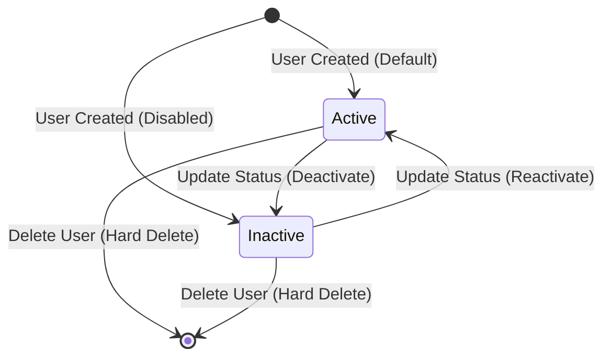

# Data Model: User CRUD Management

## Entities

### 1. User Entity

The `User` entity represents a system user managed through the administrative CRUD interface.

#### Attributes

| Field Name | Data Type | Constraints / Validation | Description |
|------------|-----------|--------------------------|-------------|
| `_id` / `id` | ObjectId / String | Required, Auto-generated | Unique document identifier in MongoDB |
| `fullName` | String | Required, Trim, Min length: 2, Max length: 100 | Full name of the user |
| `email` | String | Required, Trim, Lowercase, Unique index, Valid Email format | Unique primary contact email address |
| `role` | Enum String | Required, Values: `['ADMIN', 'USER', 'GUEST']`, Default: `'USER'` | Access authorization role |
| `status` | Enum String | Required, Values: `['ACTIVE', 'INACTIVE']`, Default: `'ACTIVE'` | Account activation state |
| `createdAt` | ISO Date / Timestamp | Required, Auto-generated | Record creation timestamp |
| `updatedAt` | ISO Date / Timestamp | Required, Auto-generated | Record last update timestamp |

---

## State Transitions

---

## Data Validation Rules

1. **Email Uniqueness**: The MongoDB collection MUST enforce a unique index on `{ email: 1 }`. The NestJS API MUST handle MongoDB duplicate key error code `11000` and return HTTP `409 Conflict`.
2. **Email Formatting**: Evaluated client-side and server-side against standard RFC 5322 regex validation.
3. **Full Name Formatting**: Non-empty string, trimmed of leading/trailing whitespace, length between 2 and 100 characters.
4. **Role Validation**: Restricted strictly to allowed enumerated strings (`ADMIN`, `USER`, `GUEST`).
5. **Status Validation**: Restricted strictly to allowed enumerated strings (`ACTIVE`, `INACTIVE`).
