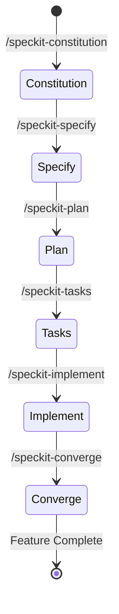

# Data Model: Spec Kit Development Workflow Documentation

## Entities

### 1. Spec Kit Command Entity

Represents a slash command step in the Spec-Driven Development pipeline.

| Attribute | Data Type | Description |
|-----------|-----------|-------------|
| `commandName` | String | e.g. `/speckit-specify` |
| `phase` | Enum String | `GOVERNANCE`, `SPECIFICATION`, `PLANNING`, `TASKS`, `IMPLEMENTATION`, `CONVERGENCE` |
| `outputArtifact` | String | Associated file path generated by command |
| `purpose` | String | Plain-language description of command objective |

---

### 2. Workflow Stage Transition

